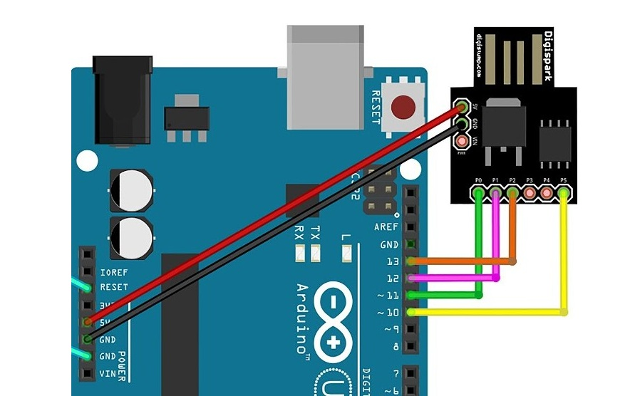

# Easy ATtiny85 Bootloader Flasher

A simple script for flashing the ATtiny85 microcontroller using an Arduino as an ISP. This project provides a user-friendly command-line interface to help users upload bootloaders and firmware to the ATtiny85.

## Features

- **User-Friendly Interface**: Interactive prompts for COM port selection.
- **Custom ASCII Art Banner**: Engaging welcome message.
- **Clear Instructions**: Detailed connection diagrams and tables for wiring the ATtiny85 to an Arduino.
- **AVRDUDE Integration**: Utilizes `avrdude` for programming the ATtiny85.

## Requirements

- Arduino Uno (or compatible)
- ATtiny85 microcontroller
- Arduino IDE installed (for `avrdude` tools)
- A Windows system for running the batch script

## Connections

### Pin Diagram



### Connections Table

| ATtiny85/Digispark Pin | Arduino Uno Pin |
|------------------------|------------------|
| Pin 0                  | Pin 11           |
| Pin 1                  | Pin 12           |
| Pin 2                  | Pin 13           |
| Pin 5                  | Pin 10           |
| 5V                     | 5V               |
| GND                    | GND              |

## Usage

1. Connect the ATtiny85 to the Arduino as per the connections table above.
2. Clone this repository to your local machine.
3. Open a Command Prompt and navigate to the directory where the script is located.
4. Run the script: 

   ```bash
   Easy-ATtiny85-Bootloader-Flasher.bat
